<p align="center">
  <a href="https://almendros.elmundodemanu.com">
    
  </a>
</p>

<p align="center">
  <b>Terror psicológico en primera persona que se juega con los oídos.</b><br>
  <sub>Ambientado en Bucaramanga, Colombia · Sin motor comercial · TypeScript + WebGL 2 + Web Audio</sub>
</p>

<p align="center">
  <a href="https://almendros.elmundodemanu.com"></a>
</p>

<p align="center">
  
  
  
  
  
  
</p>

<p align="center">
  <a href="#historia">Historia</a> ·
  <a href="#como-se-juega">Cómo se juega</a> ·
  <a href="#capturas">Capturas</a> ·
  <a href="#el-inquilino">El Inquilino</a> ·
  <a href="#tecnologia">Tecnología</a> ·
  <a href="#jugar-en-local">Jugar en local</a> ·
  <a href="#hoja-de-ruta">Hoja de ruta</a>
</p>

<p align="center">
  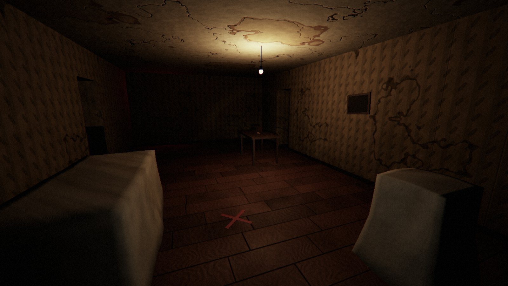
  <br>
  <sub><i>La sala del 401. La lámpara está encendida en un edificio sin luz. Nadie sabe por qué.</i></sub>
</p>

> [!IMPORTANT]
> **Juégalo con audífonos.** En este juego el sonido no es ambientación: es la interfaz del peligro.
> De noche, con la luz apagada y el volumen alto, funciona como fue pensado.

---

<a id="historia"></a>

## 🕯️ La historia

Eres un técnico de acústica. La constructora te contrató para medir el *tono de sala* de los apartamentos
del **Edificio Almendros**, en Bucaramanga, antes de demolerlo. El edificio está vacío desde marzo.

Son las **11:48 p. m.** Estás en el cuarto piso, con una linterna, una grabadora y una orden de trabajo.

Durante años, todo el edificio oyó lo que pasaba en el 402. Los gritos. Los golpes contra la pared.
Un niño llorando bajito para que no le pegaran más.

> *Todos lo oímos. Durante años.*
> *Y todos subimos el volumen del televisor.*
>
> — carta sin enviar, encontrada en el 402

Lo que nadie dijo no se fue a ningún lado. Se quedó en las paredes, oyendo. Aprendiendo voces, pasos, golpes.
Y ahora que ya no queda nadie a quien escuchar… **tiene hambre**.

La historia no se explica: se arma con lo que encuentras. Un diario. Un casete. Una nota sobre un escritorio.
Y lo que capta tu grabadora cuando crees que no pasó nada.

<p align="center"></p>

<a id="como-se-juega"></a>

## 🎧 Cómo se juega

Tu trabajo tiene una sola regla, y es la peor posible para un juego de terror:

<p align="center">
  
</p>

<p align="center"><b>Para medir una habitación tienes que quedarte quieto y en silencio durante seis segundos.</b><br>
<sub>En la oscuridad. Sabiendo que algo te está escuchando.</sub></p>

En casi todos los juegos de terror, el reflejo es huir. Aquí, para avanzar, tienes que hacer justo lo que más miedo da: **quedarte quieto**.

Todo lo que haces produce sonido, y todo sonido es información para lo que vive en los muros:

| Tú haces… | …y eso significa |
|---|---|
| 👣 **Caminar** | Cada paso suena distinto según el piso: granito, parqué, baldosa, concreto. |
| 🧱 **Pegarte a la pared** | Las paredes llevan el sonido. Caminar junto al muro te delata más. |
| 🫁 **Respirar** | Con miedo respiras más fuerte, y se oye. Puedes contener el aire… hasta que se acaba. |
| 🔦 **Usar la linterna** | Ves, pero el clic suena. Y con la pila baja, zumba. |
| 🚪 **Abrir una puerta** | De pie, la bisagra cruje. Agachado, la abres despacio y casi en silencio. |
| 👂 **Escuchar con atención** | Oyes a través de los muros, pero casi no te puedes mover. |
| 📼 **Dejar la grabadora** | Reproduce tus pasos para atraerla lejos. Después tienes que volver por ella. |

<p align="center"></p>

<a id="capturas"></a>

## 📸 Capturas

<table>
  <tr>
    <td width="50%">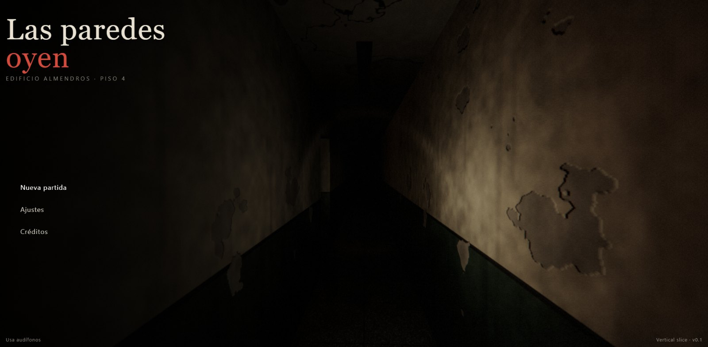</td>
    <td width="50%">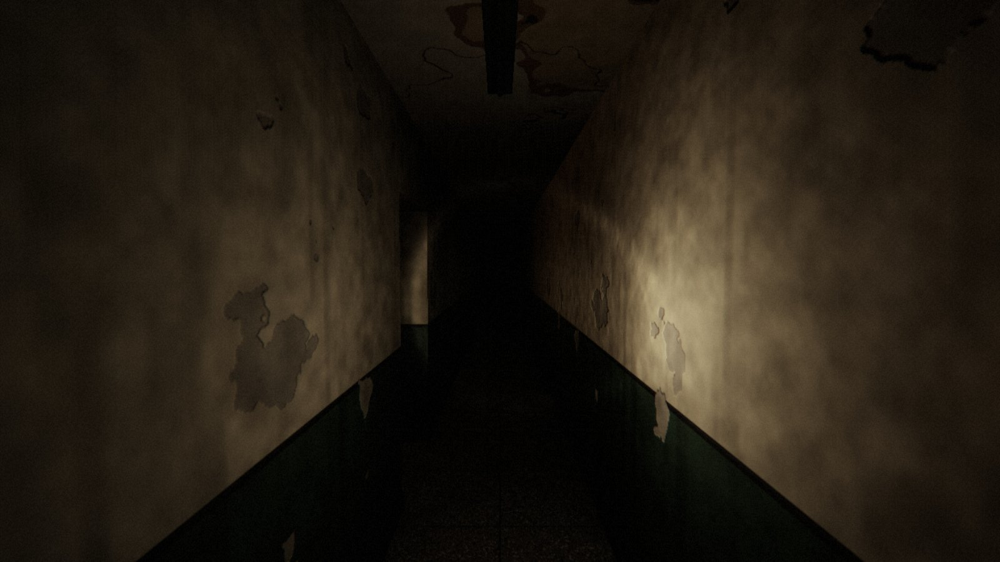</td>
  </tr>
  <tr>
    <td><sub><b>El menú.</b> Detrás del título está el pasillo real del piso 4. A veces, algo se para al fondo.</sub></td>
    <td><sub><b>El pasillo del piso 4.</b> Techos de 2.7 m, zócalo verde, pintura que se cae a pedazos.</sub></td>
  </tr>
  <tr>
    <td>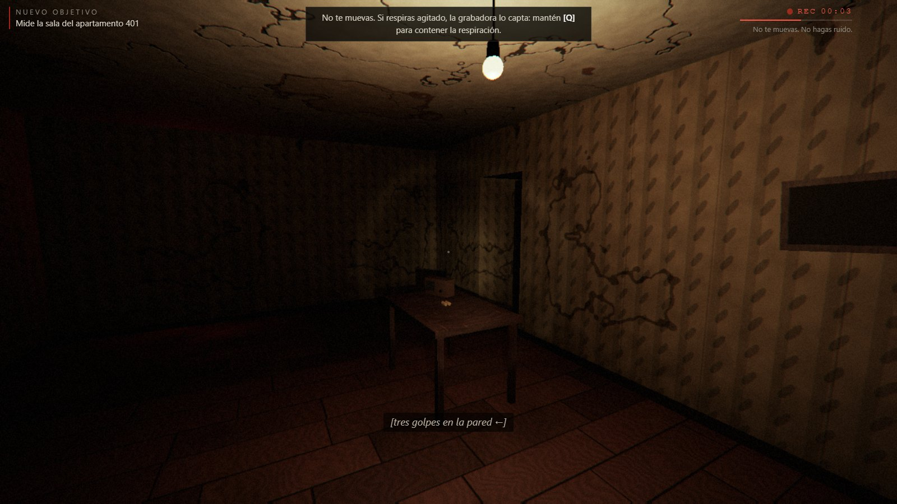</td>
    <td>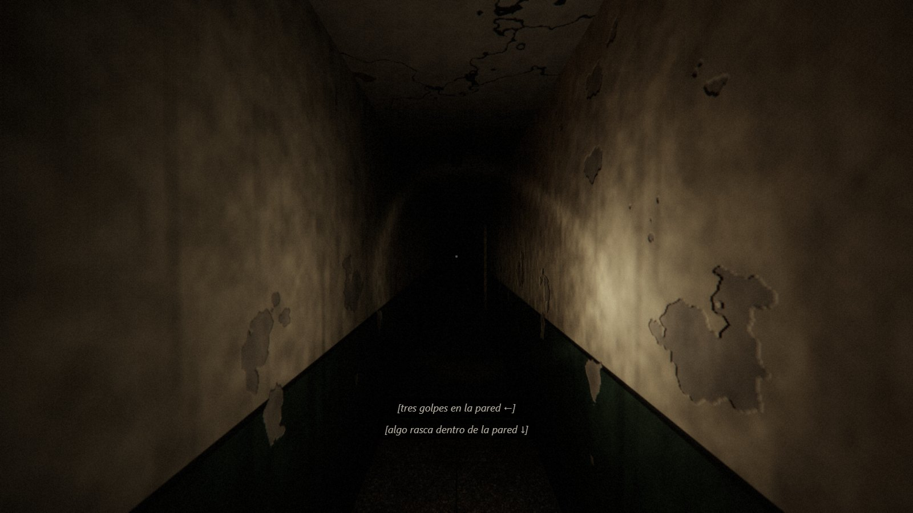</td>
  </tr>
  <tr>
    <td><sub><b>La medición.</b> REC 00:03. Tres golpes en la pared, justo a tu lado.</sub></td>
    <td><sub><b>Subtítulos con dirección.</b> Accesibilidad que dice qué sonó y de dónde vino.</sub></td>
  </tr>
  <tr>
    <td>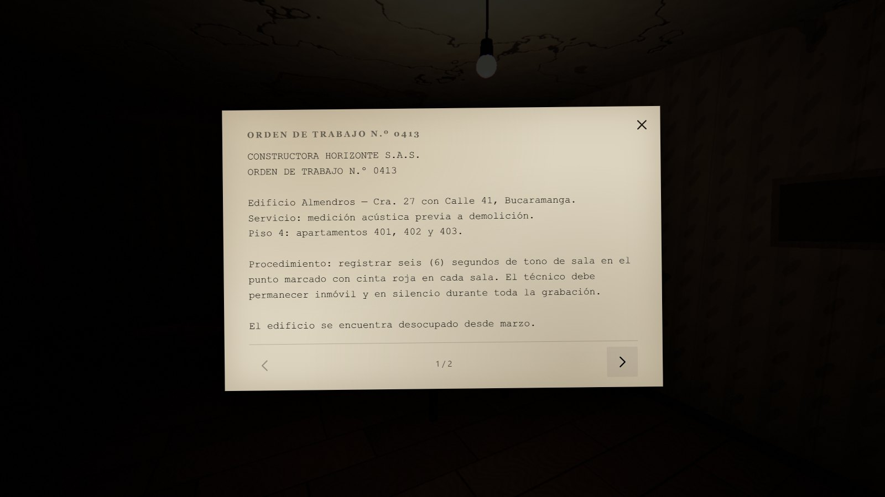</td>
    <td>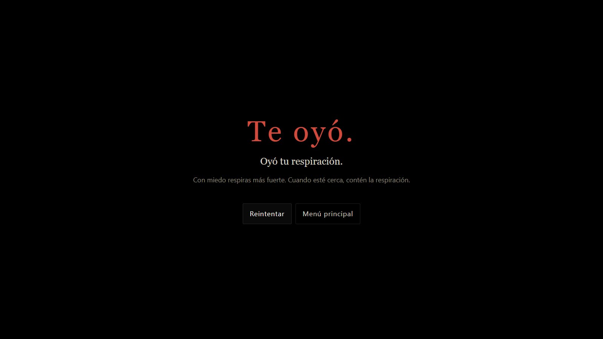</td>
  </tr>
  <tr>
    <td><sub><b>La orden de trabajo.</b> «Si oye golpes, son las tuberías. Son las tuberías.»</sub></td>
    <td><sub><b>Morir enseña.</b> El juego te dice qué oyó, y te lo hace escuchar como ella lo oyó.</sub></td>
  </tr>
  <tr>
    <td>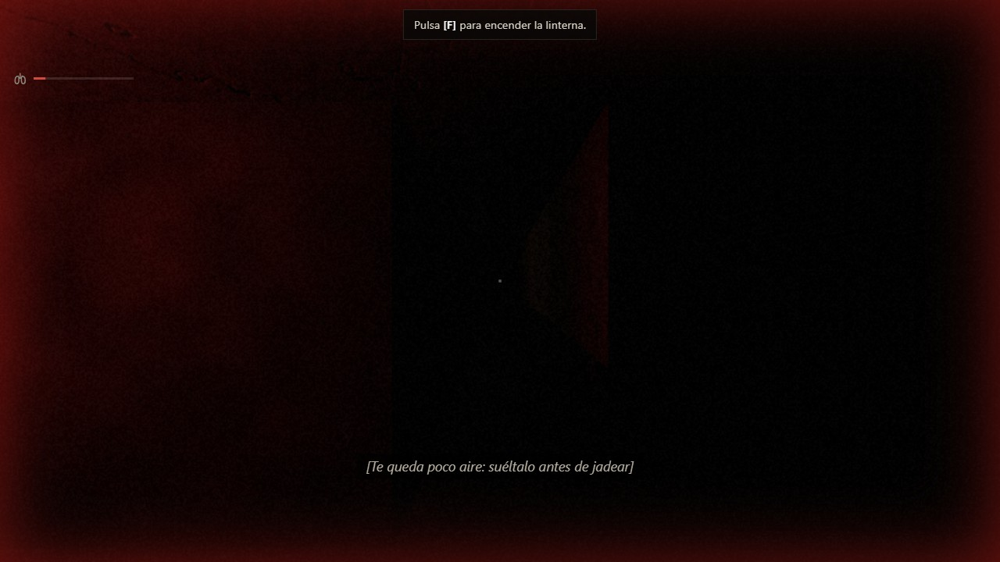</td>
    <td></td>
  </tr>
  <tr>
    <td><sub><b>Ayuda visual del aire (Historia y Accesibilidad).</b> El borde late y un subtítulo avisa antes del jadeo.</sub></td>
    <td></td>
  </tr>
</table>

<p align="center"></p>

<a id="el-inquilino"></a>

## 🩸 El Inquilino

No tiene ojos. **Solo oye.**

Vive dentro de los muros del edificio, y dentro de los muros oye mejor. No aparece para gritarte: te escucha,
te sigue, aprende tus pasos. A veces se detiene muy cerca de ti y se queda quieto, escuchando.
Y tú también tienes que quedarte quieto.

Sus reglas se pueden aprender. Descubrirlas es parte del miedo. Descubrir que tienen límites, también.

<details>
<summary><b>⚠️ Spoilers: cómo piensa El Inquilino</b> (léelo solo si ya jugaste)</summary>

<br>

**Las reglas que el jugador descubre**

1. Es ciego. Solo oye.
2. Dentro de los muros oye mejor: las paredes le llevan el sonido.
3. Hacer ruido pegado a la pared te delata más.
4. Si lo ves y no haces ruido, a veces se retira.
5. Solo mata cuando está cazando. La caza siempre tiene aviso y una causa: nunca sale del muro cazando,
   y antes de lanzarse se queda quieta un instante, gira hacia ti y jadea.
6. Si estás quieto, no camina encima de ti: se detiene a unos dos metros y **escucha**. Si contienes el aire, se va.

**Las excepciones**

- Si te mueves muy cerca de él, te siente aunque no hagas ruido.
- Con la pila baja, la linterna zumba. Y él lo oye.
- A veces su retirada es falsa: oyes pasos que se alejan, pero el cuerpo sigue ahí, de pie en la oscuridad.
- Mientras mides, se acerca por los muros. Cuando los rasguños paran, es porque llegó.
- Imita tus pasos. Primero parece un eco. Después da un paso de más. Y un día, cuando te detienes, repite tu ritmo exacto… y sigue caminando.

**Su máquina de estados**

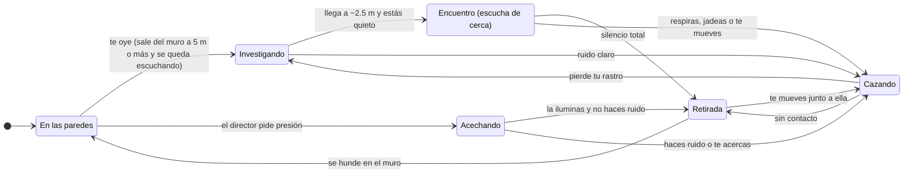

</details>

<p align="center"></p>

## 🧠 Qué lo hace diferente

| Idea | Por qué importa |
|---|---|
| **Eres quien escucha… y quien es escuchado** | El audio no decora: es la interfaz del peligro. La misma información que te salva puede exponerte. |
| **Medir = quedarse quieto** | Invierte el reflejo del género. El juego te obliga a exponerte. |
| **La grabadora capta lo que no oíste** | Al reproducir una medición aparece lo que "no estaba": una voz, tus propios pasos cuando estabas quieto. |
| **Miedo por sistemas, no por sustos** | Un director de terror decide cuándo y qué ocurre según lo que hiciste, dónde estás y qué no has visto. Solo hay dos sustos directos en todo el recorrido. |
| **El edificio recuerda** | Puertas y muebles que ya viste cambian cuando no miras. *¿Esa puerta no la había cerrado?* |
| **Muertes justas** | Si mueres, el juego te dice qué te delató. Siempre fue algo que hiciste. |
| **Identidad latinoamericana** | Edificio residencial de los años 60–70: zócalo verde, granito, parqué, papel de colgar, la red eléctrica de 60 Hz y el silencio cómplice de los vecinos. |

<p align="center"></p>

<a id="tecnologia"></a>

## ⚙️ Tecnología

**Sin motor comercial.** Todo el juego está escrito a mano en TypeScript. Three.js se usa solo como librería
de dibujo sobre WebGL 2: la IA, el audio, el director, la física, la interacción, el guardado y la interfaz son propios.

<table>
  <tr>
    <td width="50%" valign="top">

**🔊 Audio**
- Web Audio API nativa, audio 3D binaural (**HRTF**)
- **Oclusión por muros**: un golpe detrás de dos paredes suena apagado y grave
- Reverberación por convolución distinta en cada habitación
- **41 sonidos sintetizados por código**, con variantes
- **Audio híbrido**: cualquier sonido se puede reemplazar por una grabación real desde `public/audio/manifiesto.json`
  (hoy está vacío: todo lo que suena sigue siendo síntesis)
- **Firma sonora** de El Inquilino por estado: su jadeo al cazar te dice dónde está
- Tono de sala, dron que sube con la tensión y acúfeno cuando el miedo es alto

</td>
    <td width="50%" valign="top">

**👁️ IA acústica**
- Máquina de estados con **5 estados** y percepción solo auditiva
- Memoria: último ruido, rastro del jugador y sus hábitos
- Navegación A\* que abre (o revienta) puertas
- **Imitador** en tres etapas que copia el ritmo de tus pasos
- Encuentro de presencia, falsa retirada y animación a 12 poses por segundo

</td>
  </tr>
  <tr>
    <td valign="top">

**🎬 Director de terror**
- Ciclo de tensión: calma → acumulación → pico → relajación
- **13 eventos** con condiciones propias y selección por novedad
- **Memoria de tensión**: no apila sustos ni pisa una medición o un encuentro
- Se adapta a cómo juegas (pegado a los muros, corriendo, atrincherado) y afloja si mueres varias veces seguidas
- Memoria del mundo: qué habitaciones y puertas ya conoces
- Sistema de visibilidad: los cambios ocurren fuera de tu vista

</td>
    <td valign="top">

**🖥️ Render y plataforma**
- Linterna con *cookie* procedural, sombras y retraso de mano
- Texturas 100 % procedurales (≈ 210 KB comprimidos en total)
- Postprocesado HDR propio, perfiles de calidad y **resolución dinámica**
- Teclado y ratón, **mando** y **controles táctiles**. Siempre en horizontal

</td>
  </tr>
</table>

**Accesibilidad:** subtítulos de voz y de efectos **con dirección** (← → ↑ ↓), reducción de destellos y sacudidas,
calibración de brillo, balanceo de cámara desactivable, tamaño de controles táctiles y navegación completa con mando.
Además: **sin sustos fuertes** (sin cara, sin grito ni destello en la muerte) y **ayuda visual del aire** (borde
rojo pulsante y subtítulo cuando queda menos del 25 % del aire). Todo en *Ajustes → Accesibilidad*, y ambas opciones
funcionan igual en cualquier dificultad.

<details>
<summary><b>🏗️ Arquitectura</b></summary>

<br>

Módulos por responsabilidad que se comunican por un **bus de eventos tipado**. Los niveles son **datos**, el estado de la
partida se deriva de **banderas** (guardar y cargar es trivial) y todo lo programado corre en **tiempo de juego**, así que
al pausar se congela todo.

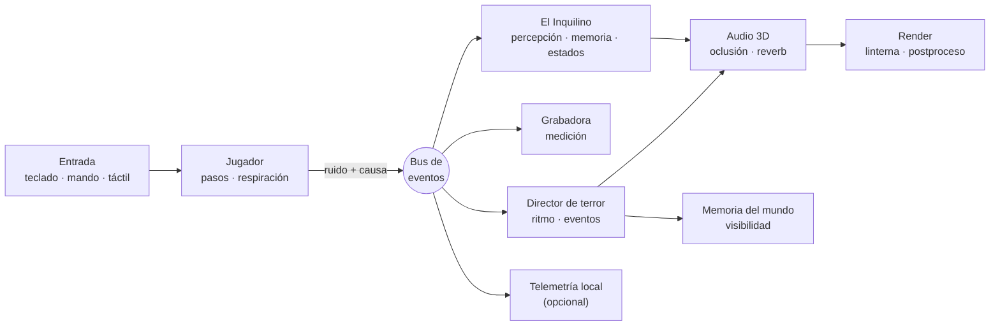

```text
src/
├─ config/        Constantes de diseño, perfiles de calidad, ajustes del jugador
├─ nucleo/        Orquestador, bucle, bus de eventos tipado, programador, contexto
├─ plataforma/    Detección de dispositivo, pantalla completa, orientación
├─ entrada/       Teclado y ratón, mando, controles táctiles
├─ render/        Renderizador, postprocesado, shaders y texturas procedurales
├─ audio/         Motor, fuentes 3D, reverberación, ambiente y síntesis
├─ mundo/         Nivel como datos, rejilla, geometría, puertas, lámparas, muebles
├─ jugador/       Movimiento, respiración, corazón, linterna, grabadora
├─ interaccion/   Sistema de interacción y objetos
├─ ia/            El Inquilino: percepción, memoria, navegación, imitador, estados
├─ director/      Director de terror, memoria del mundo, visibilidad, eventos
├─ narrativa/     Documentos, objetivos, progreso, guion, final
├─ telemetria/    Registro local de sesiones de prueba (playtesting)
├─ guardado/      Partidas guardadas con formato versionado
├─ ui/            Pantallas, HUD y componentes accesibles
└─ estilos/       CSS separado por responsabilidad
```

**¿Por qué TypeScript + WebGL 2 y no un motor?** Porque el juego tiene que correr en celulares, tabletas, portátiles y PC
con un solo código, con audio HRTF nativo e iteración instantánea. El detalle de la decisión está en la sección 13 de
[docs/01-DISENO-MAESTRO.md](docs/01-DISENO-MAESTRO.md).

</details>

<p align="center"></p>

## 🎮 Controles

| Acción | Teclado y ratón | Mando | Táctil |
|---|---|---|---|
| Moverse | <kbd>W</kbd> <kbd>A</kbd> <kbd>S</kbd> <kbd>D</kbd> | Stick izquierdo | Joystick (mitad izquierda) |
| Mirar | Ratón | Stick derecho | Arrastrar (mitad derecha) |
| Correr | <kbd>Shift</kbd> | <kbd>L3</kbd> / <kbd>LT</kbd> | Joystick al borde |
| Agacharse | <kbd>C</kbd> | <kbd>B</kbd> | Botón |
| Interactuar | <kbd>E</kbd> / clic | <kbd>A</kbd> | Mano (aparece al apuntar) |
| Linterna | <kbd>F</kbd> | <kbd>Y</kbd> | Botón |
| Contener la respiración | <kbd>Q</kbd> (mantener) | <kbd>RB</kbd> | Pulmones (mantener) |
| Escuchar con atención | Clic derecho / <kbd>Tab</kbd> | <kbd>LB</kbd> | Oreja (mantener) |
| Señuelo (grabadora) | <kbd>G</kbd> | <kbd>X</kbd> | Casete |
| Pausa | <kbd>Esc</kbd> | <kbd>Start</kbd> | Botón arriba a la derecha |

<a id="jugar-en-local"></a>

## 🚀 Jugar en local

**Requisitos:** [Node.js](https://nodejs.org) 20 o superior y un navegador con WebGL 2 (Chrome, Edge, Firefox o Safari actualizados).

```bash
git clone https://github.com/Manu270422/las-paredes-oyen.git
cd las-paredes-oyen
npm install
npm run dev
```

Abre `http://localhost:5173`. Para jugar en el celular, conéctalo a la misma red Wi-Fi y abre la dirección
*Network* que muestra la terminal (por ejemplo `http://192.168.1.10:5173`).

| Comando | Qué hace |
|---|---|
| `npm run dev` | Servidor de desarrollo con recarga instantánea |
| `npm run typecheck` | Revisa los tipos sin compilar |
| `npm run build` | Revisa los tipos y genera la versión final en `dist/` |
| `npm run preview` | Sirve la versión final para probarla |
| `npm test` | Todas las pruebas: tipos de las pruebas, lógica pura y los recorridos en el juego real |

La versión final es un sitio estático con rutas relativas: `dist/` se puede publicar en cualquier dominio o subcarpeta.
La versión pública está **publicada en Vercel** (que ejecuta `npm run build`) con el dominio
[almendros.elmundodemanu.com](https://almendros.elmundodemanu.com).

### Pruebas

Todo vive en `pruebas/`. Ni `npm run build` ni el despliegue en Vercel las cargan ni las ejecutan.

| Comando | Qué prueba | Tiempo |
|---|---|---|
| `npm run test:unit` | Lógica pura con Vitest: memoria de tensión, alivio, respiración, la cinta de la grabadora, explicaciones de muerte, sistema de dificultad, migración de telemetría, el hueco de la escalera y los rastros | ~3 s |
| `npm run test:e2e` | El juego real con Playwright (32 recorridos): interfaz, guardado, pantalla de dificultad, guardado por dificultad, oferta de bajar un escalón, accesibilidad, la escalera y los rastros (que se vean con la linterna) | ~20 min |

**Navegador para `test:e2e`:** por defecto usa el **Google Chrome que ya tienes instalado** (no descarga nada).
Para usar otro:

```bat
:: Microsoft Edge (viene con Windows)
set PRUEBAS_NAVEGADOR=msedge
npm run test:e2e

:: Chromium de Playwright (descarga ~150 MB la primera vez)
npx playwright install chromium
set PRUEBAS_NAVEGADOR=chromium
npm run test:e2e
```

En macOS o Linux: `PRUEBAS_NAVEGADOR=msedge npm run test:e2e`. Las pruebas levantan su propio servidor en el puerto 5174,
así que pueden correr con `npm run dev` abierto.

> [!TIP]
> En modo desarrollo el juego queda expuesto en la consola del navegador como `window.__juego`, por ejemplo
> `__juego.jugador.teletransportar(9.5, 7.5, 180)`.

## 🧪 Pruebas con jugadores

El vertical slice ya asustó lo suficiente como para que su creador lo cerrara antes de terminarlo. Ahora hay que
convertir esa anécdota en datos.

- El juego trae **telemetría local y opcional**: tiempos, sustos, muertes y su causa, reacciones y la curva de estrés de la partida.
- Se activa en **Ajustes → Pruebas** o abriendo el juego con `?telemetria=1`. **Nada se envía a internet**: se guarda en el
  dispositivo y solo sale si tú la exportas a `.json`.
- El procedimiento completo para probar con personas está en [docs/04-PROTOCOLO-PLAYTESTING.md](docs/04-PROTOCOLO-PLAYTESTING.md).

¿Lo jugaste? Cuéntame en qué momento exacto te dio miedo, qué muerte sentiste injusta o qué no entendiste,
en los [issues del repositorio](https://github.com/Manu270422/las-paredes-oyen/issues).

<a id="hoja-de-ruta"></a>

## 🗺️ Hoja de ruta

- [x] **Vertical slice**: piso 4, cinco documentos, tres mediciones, el apagón y el final
- [x] **IA acústica** con encuentro de presencia, imitación en etapas y muertes explicadas
- [x] **Telemetría local** y protocolo de playtesting
- [x] **Firma sonora** de El Inquilino por estado y audio híbrido (grabaciones reales + síntesis)
- [x] **La grabadora como segunda realidad**: lo que capta sale de lo que de verdad pasó fuera de tu vista
- [x] **Director adaptativo**: memoria de tensión, estilo de juego y alivio tras muertes seguidas
- [x] **Pisos como paquetes de datos** y guardado con migración de versiones (Sprint 3)
- [x] **Viento acústico**: el aire de los pasillos suena diferente según el mapa, y cambia al abrirse puertas (Sprint 3)
- [x] **Sistema de dificultad**: Historia · Normal · Difícil · Pesadilla — puntos de control por dificultad, cambio en plena partida sin penalización, Pesadilla no guarda ni borra otras partidas (Sprint 4)
- [x] **Accesibilidad visual**: sin sustos fuertes (sin cara, sin grito ni destello) y ayuda visual del aire (borde rojo + subtítulo antes del jadeo), independientes de la dificultad (Sprint 4)
- [x] **Telemetría v2**: dificultad y versión de compilación en cada sesión; migración automática de sesiones v1 (Sprint 4)
- [x] **Escalera visible**: el hueco con sus tramos, la reja con cadena del que baja y la oscuridad del fondo
- [x] **Sangre narrativa**: rastros de lo que pasó que solo descubre la linterna; cuentan la historia sin una palabra en pantalla
- [ ] **Playtesting** con al menos cinco personas (una en celular) y ajuste con esos datos
- [ ] **Calidad visual**: El Inquilino en glTF con esqueleto, sin perder sus 12 poses por segundo
- [ ] **Nuevos espacios**: *el hueco* entre el 401 y el 403, el piso 3, el cuarto de bombas y la azotea
- [ ] **Versiones nativas** para PC (Tauri) y móvil (Capacitor)

El detalle, fase por fase, está en [docs/03-HOJA-DE-RUTA.md](docs/03-HOJA-DE-RUTA.md).

## 📚 Documentación

| Documento | Contenido |
|---|---|
| [01 · Diseño maestro](docs/01-DISENO-MAESTRO.md) | Concepto, la criatura, mecánicas y decisiones de diseño |
| [02 · Arquitectura](docs/02-ARQUITECTURA.md) | Módulos, flujo de un fotograma y extensibilidad |
| [03 · Hoja de ruta](docs/03-HOJA-DE-RUTA.md) | Lo hecho, lo que sigue y por qué en ese orden |
| [04 · Protocolo de playtesting](docs/04-PROTOCOLO-PLAYTESTING.md) | Cómo medir el miedo con personas reales |

> [!WARNING]
> **Advertencia de contenido.** Terror psicológico, sonidos fuertes repentinos, destellos de luz y referencias a violencia
> doméstica. Los destellos, las sacudidas de cámara, el grito y la cara de la criatura se pueden desactivar en
> *Ajustes → Accesibilidad* con la opción **«Sin sustos fuertes»**, disponible en cualquier dificultad.

<details>
<summary><b>🇬🇧 In English</b></summary>

<br>

**Las paredes oyen** (*The walls have ears*) is a first-person psychological horror game played with your ears.
You are an acoustics technician measuring the empty apartments of an old residential building in Bucaramanga, Colombia,
before its demolition. To measure a room you must stand **perfectly still and silent for six seconds**, in the dark,
while something blind that lives inside the walls listens for you. Every step, every breath and every click of your
flashlight is information for it.

Built without a commercial engine: TypeScript, WebGL 2 (Three.js as a drawing library only) and the Web Audio API,
with binaural HRTF audio, wall occlusion, per-room convolution reverb, 41 procedurally synthesized sounds, an acoustic
AI, and a horror director. It runs in the browser on PC, phones and tablets. The game is currently Spanish-only.
Play it at [almendros.elmundodemanu.com](https://almendros.elmundodemanu.com). Headphones required.

</details>

---

<p align="center">
  
</p>

<p align="center">
  Creado por <b>Manu</b> · <a href="https://github.com/Manu270422">@Manu270422</a> · <a href="https://almendros.elmundodemanu.com">almendros.elmundodemanu.com</a><br>
  <sub>© 2026 Manu. Todos los derechos reservados.</sub>
</p>

<p align="center"><i>Las paredes oyen. Y ahora, tú también.</i></p>
